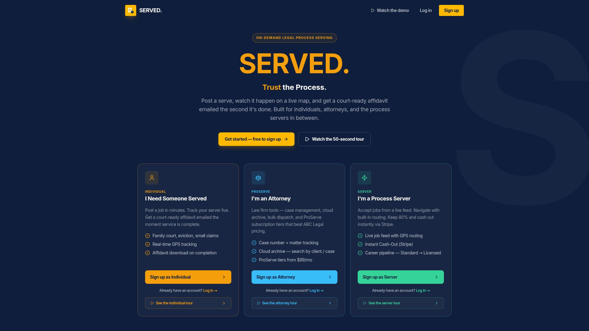

# SERVED. — Process Serving Marketplace

A product and systems portfolio project by Carla McGhee, connecting individuals and law firms with process servers through role-specific workflows.

**[Explore the public demo](https://servedapp.replit.app/demo)** · [Live app](https://servedapp.replit.app/) · [Product case study](docs/product-case-study.md) · [Architecture](docs/architecture.md) · [Verification](docs/verification.md)



## The business problem

Requesters need visibility into a service request, law firms need structured case and document workflows, and process servers need clear assignments and payment status. SERVED brings those needs into one marketplace with distinct experiences for each role.

## What to review first

1. Choose a perspective in the public demo: individual, attorney, or process server. The tours illustrate the intended experience; they are not proof that a live transaction completed.
2. Read the [case study](docs/product-case-study.md) for personas, workflows, business rules, and proposed acceptance scenarios.
3. Inspect the [API contract](lib/api-spec/openapi.yaml), [database schema](lib/db/src/schema), and [pricing rules](lib/pricing/src/index.ts).
4. Review the [verification record](docs/verification.md) for what was checked and what still needs an authenticated integration environment.

## Implementation scope

| Area | Included in the exported source | Verification boundary |
| --- | --- | --- |
| Role-specific UI | Individual, attorney, process-server, and administrator pages | Public landing page and individual tour inspected; authenticated portals not exercised in this review |
| Authentication | Clerk integration, database role lookup, route role guards | Requires a configured Clerk instance and account-level access testing |
| Job lifecycle | Drafts, pending payment, dispatch, acceptance, attempts, and completion routes | Source and existing tests reviewed; full live lifecycle not performed |
| Money rules | Integer-cent pricing, tier tables, 20% platform / 80% server split | Shared pricing implementation; live charges and transfers not tested |
| Payments | Stripe Checkout, subscriptions, Connect, webhooks, and payout handling | Stripe credentials are supplied through Replit connectors |
| Evidence and affidavits | Service-attempt validation, document storage, PDF generation, and notifications | Existing unit/regression tests; no claim of legal approval or live notarization |
| Location tracking | Location routes and job tracking UI | Device GPS, update cadence, and geographic coverage not verified |
| Jurisdictions | Tables and seeds for credential and eligibility configuration | Eligibility computation and dynamic matching are deferred according to the source notes |

The marketing site makes operational claims. This repository documents software implementation and review evidence; it does not independently establish licensing coverage, legal sufficiency, service availability, or payment settlement times.

## Technology

React 19, TypeScript, Vite, Tailwind CSS, Express 5, PostgreSQL, Drizzle ORM, Clerk, Stripe, and an OpenAPI contract with generated clients. The exported workspace also includes an attorney demo, server training artifact, and mockup sandbox.

## Repository map

| Path | Purpose |
| --- | --- |
| `artifacts/served-app` | Main web application, public tours, and role-specific portals |
| `artifacts/api-server` | API routes, workflow rules, PDF generation, and regression tests |
| `lib/db` | PostgreSQL schema and Drizzle migrations |
| `lib/pricing` | Shared pricing and fee split calculations |
| `lib/api-spec` | OpenAPI contract and client generation configuration |
| `lib/api-client-react`, `lib/api-zod` | Generated client and validation packages |
| `lib/integrations` | Email, SMS, and background-check adapters |
| `artifacts/attorney-demo`, `artifacts/server-training` | Additional presentation and training experiences |
| `docs` | Portfolio case study, architecture, setup, and verification record |

## Setup and checks

This is a Replit-oriented monorepo, not a standalone static site. The exported dependency overrides target Linux x64. See [setup](docs/setup.md) before starting the full backend.

```sh
pnpm install --frozen-lockfile
pnpm --filter @workspace/api-server run test:unit
pnpm run typecheck
```

Do not use the root build as a read-only check: the exported API build first invokes `drizzle-kit push`, which can change the configured database schema. For an API compilation check without a database push:

```sh
cd artifacts/api-server
node build.mjs
```

Clerk, a disposable PostgreSQL database, storage, and provider configuration are needed for authenticated end-to-end testing. Keep credentials in local environment settings or Replit Secrets. Never commit an environment file containing values.

## Portfolio context

Prepared from the owner-supplied Replit export. The product is AI-assisted; the portfolio documentation was reconstructed from the implementation and distinguishes observed evidence from proposed acceptance checks. No usage, revenue, conversion, or time-savings outcomes are claimed. Raw attached working assets and exported documents are omitted from this portfolio package.
