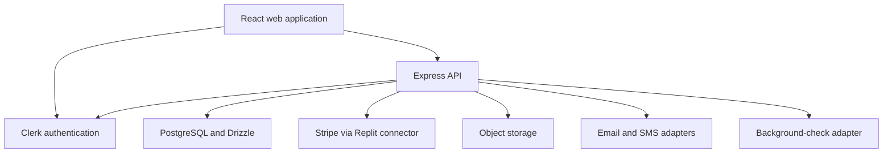

# Architecture and integration boundaries

## Components

The frontend uses generated client packages from an OpenAPI contract. The API organizes jobs, users, documents, location pings, marketplace views, payments, and administrator operations into route modules.

## Authorization

Clerk establishes authenticated identity. `requireAuth` then reads the current role from the database; `requireRole` enforces permitted role types. Resource routes contain further ownership and assignment checks. These mechanisms are source evidence, not a completed security audit.

## Data model

The schema includes users, clients, servers, jobs, service attempts, documents, job location pings, subscriptions, payments, payouts, credentials, audit records, and durable checkout queues. Jurisdiction tables extend the model for credential requirements and future computed eligibility.

## External dependencies

- Clerk keys and a configured instance for authentication.
- PostgreSQL via `DATABASE_URL`.
- Stripe through authenticated Replit connector access; ordinary standalone Stripe environment variables are not the current credential path.
- Replit object-storage configuration for uploads and generated documents.
- Configured email/SMS providers for delivery; source adapters also expose stub modes.
- Certn credentials and webhook configuration for background checks.

## Important operational distinction

The backend startup can initialize Stripe webhooks and start background payout/license-notification workers. The API build script runs a database schema push before compilation. Reviewers should use isolated test resources and the documented compilation-only command when they only need to inspect/build the code.

The portfolio review does not alter or redeploy the existing live Replit application.
