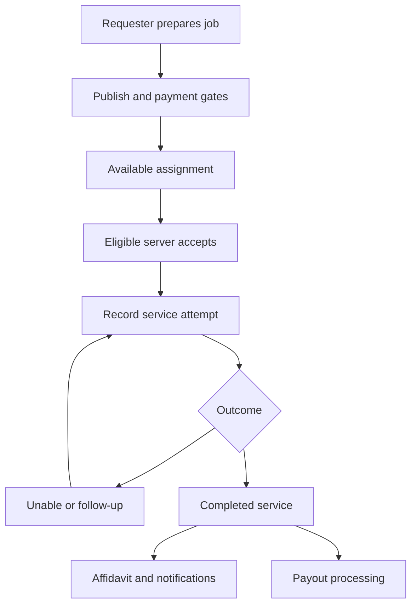

# Product case study

This case study is reconstructed from the exported source and public experience. It describes the current design; it is not a claim that these requirements were signed off before development.

## Personas and needs

| Persona | Need | Product response |
| --- | --- | --- |
| Individual requester | Submit a request and understand its progress | Job intake, status views, tracking, and document access |
| Attorney / law firm | Organize matters and manage multiple requests | Case fields, drafts, bulk checkout, archive, and subscription pricing |
| Process server | Find eligible work and record attempts | Job feed, acceptance gates, pickup handling, attempts, and wallet |
| Administrator | Manage exceptions and server access | Server lifecycle, account administration, and audit views |

## Primary workflow

This is a conceptual workflow. API and payment states have additional transitions; consult the routes and schema for the implementation.

## Business rules in the source

- Monetary values use integer cents. The platform receives 20%; the server receives the remainder so the split reconciles to the gross.
- Pricing depends on the subscription tier and service type. The job captures its pricing context rather than recalculating every historical job from today's price table.
- Jobs awaiting payment cannot enter the normal dispatch flow.
- Publishing requires requesting-party details and valid documents-served entries; drafts can remain incomplete until publication.
- Pickup and either-mode jobs require firm pickup details.
- Server eligibility and verification gates apply before accepting or completing work.
- Service attempts have outcome-specific required fields, including substitute-recipient and mailing details where the implemented rules require them.
- Job finalization and checkout queues contain retry/idempotency controls to prevent duplicate state advancement.
- Notification delivery depends on provider configuration and user opt-out settings; a missing provider may use a logging stub.

## Proposed acceptance scenarios

These are reviewer scenarios, not a completed UAT sign-off.

| ID | Trigger | Expected behavior |
| --- | --- | --- |
| AC-01 | A requester attempts to read another user's job | Access is denied without disclosing the job details |
| AC-02 | Publish an incomplete job | The server rejects publication with actionable validation |
| AC-03 | Attempt dispatch before payment confirmation | The job stays unavailable for normal dispatch |
| AC-04 | Two servers attempt to accept the same job | Only one assignment succeeds |
| AC-05 | Record a substitute attempt without required recipient details | Validation fails and does not finalize service |
| AC-06 | Retry completion or a payment webhook | No duplicate finalization or payout side effect |
| AC-07 | Calculate a fee split | Platform cents plus server cents equals gross cents |
| AC-08 | Retry a pickup notification | The event does not create duplicate notifications |
| AC-09 | Navigate the public tours without signing in | Perspective selection and navigation remain usable |
| AC-10 | Review the jurisdiction foundation | Unimplemented eligibility/matching work is clearly identified |

## Outcomes to measure later

A future pilot could measure intake completion rate, time to assignment, successful completion rate, affidavit delivery failures, support contacts per job, and payout exception rate. This export does not establish those results.
